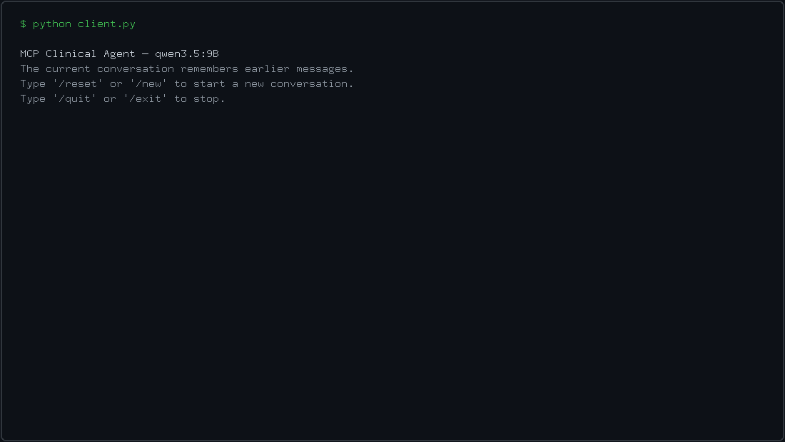
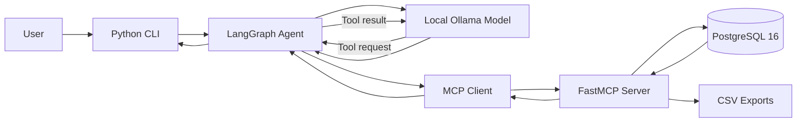
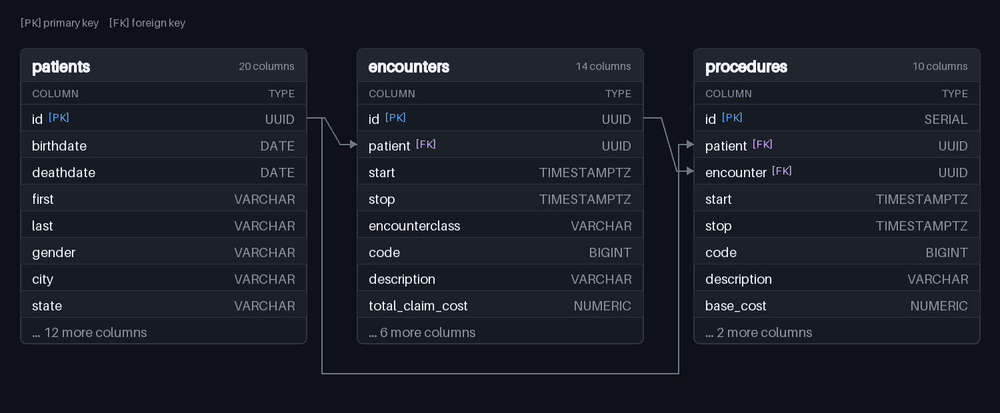

# MCP Clinical Agent

A local AI agent built with **Ollama, LangGraph, the Model Context Protocol (MCP), and PostgreSQL** for natural-language querying, multi-turn analysis, schema inspection, and CSV export over synthetic clinical data.

The project runs the language model and database locally, allowing the agent to reason about warehouse questions, discover MCP tools dynamically, execute read-only SQL, recover from tool errors, and preserve context across follow-up questions.

## Demo

<p align="center">
  
</p>

This animation recreates a verified live `qwen3.5:9B` run. The final request creates `exports/benchmark_patients.csv` with 509 unique patient rows.

## Why This Project Exists

Clinical researchers, data coordinators, and compliance teams often need answers from relational data without writing SQL themselves. At the same time, clinical data may be unsuitable for external model APIs because of privacy, governance, or infrastructure requirements.

MCP Clinical Agent explores a local alternative:

- PostgreSQL stores the clinical warehouse locally.
- Ollama runs the language model locally.
- MCP exposes specific database capabilities as discoverable tools.
- LangGraph manages the model to tool loop and conversation state.
- A restricted PostgreSQL role separates model queries from administrative data loading.

The project was also built as a learning-focused portfolio project. Its architecture is intentionally substantial enough to demonstrate agent orchestration, asynchronous Python, MCP, PostgreSQL, and local inference, while remaining small enough to understand from end to end.

## How It Works

### Architecture



### Agent Execution Flow

1. The user enters a question in the command-line interface.
2. The CLI sends the new message to a LangGraph conversation thread.
3. LangGraph provides Ollama with the conversation history and the tools discovered from the MCP server.
4. The model decides whether it can answer directly or needs to call a tool.
5. If a tool is requested, LangGraph sends the tool name and arguments through the MCP client.
6. The FastMCP server queries PostgreSQL, inspects the schema, or creates a CSV export.
7. The tool result is appended to the conversation and returned to the model.
8. The model may call another tool, correct a failed request, or provide a final answer.
9. LangGraph stores the updated state under the current thread ID so later questions can refer to earlier results.

The graph itself contains only two operational nodes:

```text
call_model → execute_tools → call_model
```

A conditional edge ends the turn when the model returns a final answer instead of another tool request. A maximum tool-round limit prevents an unsuccessful agent from looping indefinitely.

### Available MCP Tools

| Tool | Purpose |
|---|---|
| `execute_readonly_query` | Executes a PostgreSQL query through the restricted model database role. |
| `get_database_schema` | Returns accessible tables, columns, data types, primary keys, and foreign-key relationships. |
| `export_query_to_csv` | Executes a query and writes its complete result to the local `exports/` directory. |

The MCP client discovers these tools dynamically and adapts their input schemas to Ollama's tool-calling format. The LangGraph workflow does not contain a hard-coded branch for each tool, so another MCP tool can be added without redesigning the agent loop.

### Data Model

<p align="center">
  
</p>

The diagram shows the columns most useful for understanding the joins.

## Key Design Decisions

### Dynamic MCP Tool Discovery

The application asks the MCP server which tools are available at startup and passes their schemas to Ollama. The model (not a hard-coded Python branch) decides whether a tool is needed, which tool to call, and what arguments to provide.

This preserves MCP's main architectural benefit: the server can expose additional capabilities without requiring a separate LangGraph path for each one.

### Explicit LangGraph Agent Loop

LangGraph manages conversation state, routing, tool execution cycles, and termination, while the model remains responsible for tool selection and response generation.

This makes the request path easier to trace and explain while still supporting multiple tools and autonomous error correction.

### Read-Only Database Separation

The ETL script connects as `admin_user` to create tables, load data, and provision permissions. The MCP server connects separately as `llm_user`, which receives `SELECT` access to the warehouse tables.

This places the primary write-protection boundary in PostgreSQL rather than relying only on instructions given to the model.

### Simple ETL for Controlled Inputs

The project loads three known Synthea CSV files directly with PostgreSQL `COPY`. It does not include a generic upload framework, configurable header mapping, or a transformation pipeline because those abstractions would add code without solving a requirement of the current project.

### In-Memory Conversation Checkpointing

LangGraph uses an in-memory checkpointer indexed by a unique thread ID. This supports follow-up questions such as “How many of those patients were female?” while keeping the implementation simple.

Starting a new thread with `/reset` or `/new` removes access to the previous conversation. Conversation history is not persisted after the application exits.

### Focused Modules Instead of Excessive Abstraction

The code is split by clear responsibilities—configuration, orchestration, MCP client communication, MCP server tools, ETL, and the CLI (without introducing service layers, repositories, dependency-injection frameworks, or generic interfaces that the project does not need)

## Evaluation

Two consecutive, independently verified debug mode runs with `qwen3.5:9B` each scored 20 correct answers out of 20. The [primary benchmark report](benchmarks/BENCHMARK.md) documents every prompt, generated SQL, tool sequence, answer, timing, and verification result across both runs.

> A 20/20 benchmark is evidence about the documented runs, not proof that the application is perfect or fully deterministic. Local model output is probabilistic: the same query may follow a different reasoning or tool path, take a different amount of time, or produce a different result on another run.

### Model and Runtime Comparison

All runtime and latency figures below were measured on an NVIDIA Tesla T4 with 16 GB of VRAM. Newer GPUs can substantially reduce absolute local-inference time, so these timings should not be extrapolated directly to faster hardware.

| Model and run | Thinking | Scope | Observed result | Runtime | Notable failures |
|---|:---:|---|---:|---:|---|
| Gemma 4 12B, first run | On | 20 questions | 20/20 | Not recorded | None observed; no preserved debug transcript |
| Gemma 4 12B, second run | On | 20 questions | 18/20 | 24.45 min | Q8 and Q16 returned ungrounded answers without tool calls |
| Gemma 4 12B, no-thinking run | Off | 20 questions | 18/20 | 4.28 min | Q8 and Q20 returned ungrounded answers without tool calls |
| Qwen 3.5 9B, runs one and two | On | 20 questions x 2 | 20/20, 20/20 | 19.76, 21.81 min | None in the scored outcomes |
| Qwen 3.5 9B, no-thinking run | Off | 20 questions | 18/20 | 12.11 min | Q19 ignored distinct-patient export; Q20 omitted last names |

The benchmark covered:

- Schema discovery
- Single-table counts and filtering
- Aggregation and grouping
- Multi-table joins
- Distinct-patient calculations
- Date-based analysis
- Multi-turn references
- CSV export
- PostgreSQL error recovery

The evaluation exercised the complete path from the user prompt through the interactive CLI, Ollama, LangGraph, MCP, PostgreSQL, and the final response. Generated SQL was reviewed for logical correctness, and the CSV export was compared with an independent reference query.

A larger automated evaluation with repeated, adversarial, concurrency, load, and security tests is still needed before making this project ready for production.

## Project Structure

```text
mcp-clinical-agent/
├── agent_graph.py       # LangGraph state, model/tool loop, routing, and memory
├── assets/              # README demo and data-model visual
├── benchmarks/          # Primary benchmark and historical model comparisons
├── client.py            # Interactive multi-turn command-line application
├── config.py            # Model settings, debug mode, limits, and system prompt
├── csv_to_sql.py        # Database schema creation, CSV ingestion, and role setup
├── mcp_client.py        # MCP subprocess lifecycle, tool discovery, and invocation
├── mcp_server.py        # FastMCP tools, connection pool, schema inspection, and export
├── docker-compose.yaml  # PostgreSQL 16 container configuration
├── patients.csv         # Synthetic patient data
├── encounters.csv       # Synthetic encounter data
├── procedures.csv       # Synthetic procedure data
└── exports/             # CSV files generated by the agent
```

## Technology Stack

| Technology | Role |
|---|---|
| Python | Application, orchestration, MCP, and ETL logic |
| PostgreSQL 16 | Relational clinical data warehouse |
| psycopg 3 | PostgreSQL driver and asynchronous connection pooling |
| Model Context Protocol | Discoverable model-facing tool interface |
| FastMCP | Asynchronous MCP server implementation |
| LangGraph | Stateful model/tool execution loop and conversation checkpointing |
| Ollama | Local language model inference |
| Qwen 3.5 9B | Reasoning, tool selection, SQL generation, and final responses |
| Docker Compose | Reproducible local PostgreSQL environment |

## Setup

The commands below target Linux, which is the environment used to develop and test the project.

### 1. Clone the repository

```bash
git clone https://github.com/Capver/mcp-clinical-agent.git
cd mcp-clinical-agent
```

### 2. Create and activate a virtual environment

```bash
python -m venv .venv
source .venv/bin/activate
```

### 3. Install the Python dependencies

```bash
pip install -r requirements.txt
```

### 4. Install or update Ollama and pull the model

```bash
curl -fsSL https://ollama.com/install.sh | sh
ollama pull qwen3.5:9B
```

The standard Linux installation runs Ollama as a system service. If `ollama pull` cannot connect to it, start the service with `sudo systemctl start ollama` and retry the pull.

### 5. Start PostgreSQL

```bash
docker compose up -d
```

### 6. Load the synthetic data

```bash
python csv_to_sql.py
```

The script recreates the warehouse tables, loads the CSV data using PostgreSQL `COPY`, creates `llm_user`, and grants the role read-only table access. Rerunning the script resets the warehouse.

### 7. Start the application

```bash
python client.py
```

## Usage

Example questions:

```text
How many patients are in the database?

Which five procedures occurred most frequently?

How many unique patients received the most common procedure?

Export one row for each of those patients with their ID and name.
```

CLI commands:

```text
/reset or /new    Start a new conversation thread
/quit or /exit    Close the application
```

### Debug Mode

Set the following value in `config.py`:

```python
DEBUG_MODE = True
```

Debug mode displays:

- Discovered MCP tools
- Model reasoning returned by Ollama
- Tool names and arguments
- MCP tool results
- Tool rounds used during the current user turn

Set it back to `False` for a cleaner conversation.

### Model Thinking

Ollama thinking is independently configurable:

```python
MODEL_THINKING = True
```

Setting it to `False` hides the model's extended reasoning and can reduce latency, but the benchmark comparison above found worse instruction fidelity. The observed speedup was measured on the Tesla T4 described above and may differ substantially on newer hardware. This setting does not change which tools are available or force the model to call one.

### CSV Exports

When the user requests an export, generated files are written to exports/. An existing file with the same name is overwritten.

## Data Source

The project uses synthetic clinical data generated with Synthea. It currently expects three CSV exports:

- `patients.csv`
- `encounters.csv`
- `procedures.csv`

These files represent synthetic patients and clinical events. They are not real medical records. The limited three-table schema was chosen to keep the relational model understandable while still supporting joins, aggregations, temporal analysis, and patient-level exports.

## Limitations

- Conversation memory exists only while the client process is running.
- Query results are returned in full and may exceed the model context window for very large outputs.
- The application does not include a comprehensive query policy engine.
- Two complete and perfect Qwen runs were performed, but the sample remains too small for a statistically meaningful reliability claim.
- The warehouse contains only three synthetic clinical tables.
- Model behavior remains probabilistic. Even with a low temperature, the same query can produce a different path or result.

## Room for Improvement

- Add deterministic integration tests for MCP tools and database behavior.
- Persist LangGraph conversation checkpoints across application restarts.
- Add configurable result-size controls for large database responses.
- Expand the synthetic warehouse with additional Synthea tables and relationships.
- Compare additional local models by accuracy, latency, and hardware usage.

## Disclaimer

This project was created for learning, experimentation, and portfolio demonstration. It uses synthetic data and is not a medical device, or a product ready for production with real patient information.

Any real clinical deployment would require formal privacy, security, governance, validation, access-control, monitoring, and regulatory review appropriate to the organization and jurisdiction.
